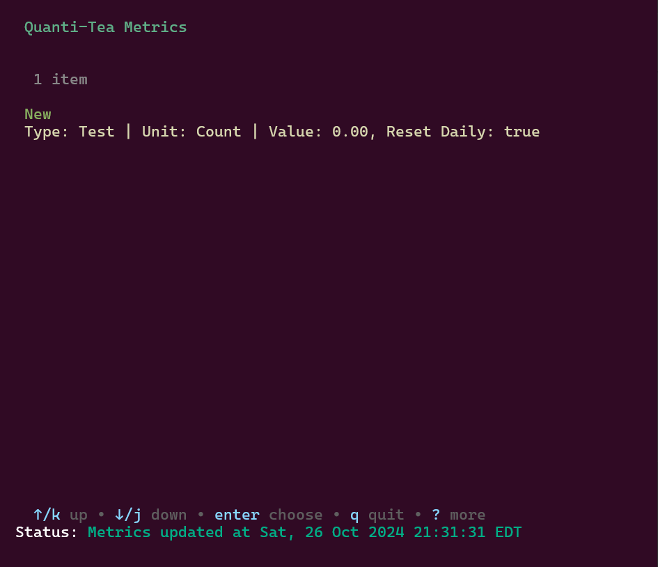
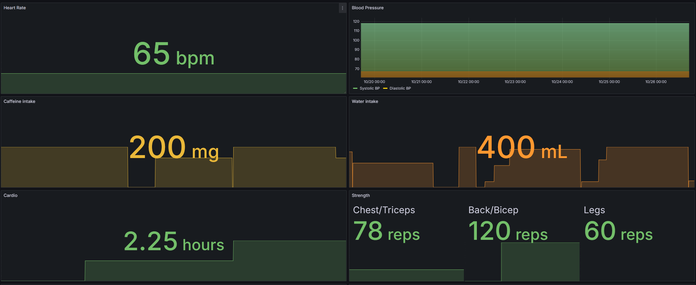

# Quanti-Tea


Quanti-Tea is a comprehensive suite for self-quantified analytics, integrating a Terminal User Interface (TUI) with Prometheus for metrics storage and Grafana for visualization. It allows users to manage metrics efficiently and observe them through intuitive dashboards.

## Table of Contents

- [Overview](#overview)
- [Motivation](#motivation)
- [Features](#features)
- [Architecture](#architecture)
- [Installation](#installation)
  - [Prerequisites](#prerequisites)
  - [Cloning the Repository](#cloning-the-repository)
  - [Building](#building-quanti-tea)
  - [Setting Up Quanti-Tea-Steep (Server)](#setting-up-quanti-tea-steep-server)
  - [Setting Up Quanti-Tea (TUI)](#setting-up-quanti-tea-tui)
- [Integration with Prometheus and Grafana](#integration-with-prometheus-and-grafana)
- [Repository Structure](#repository-structure)

## Overview

Quanti-Tea empowers users to perform self-quantified analytics by providing a user-friendly Terminal User Interface for managing metrics. The server component, Quanti-Tea-Steep, handles data processing and storage, ensuring seamless integration with Prometheus and Grafana for robust data visualization and monitoring. 

Quanti-Tea is designed to be highly adaptable, allowing users to quantify a diverse range of metrics without limitation to specific categories or formats. This flexibility is achieved through its generic and agnostic structure, which includes configurable fields for both metric **types** and **units**. As a result, Quanti-Tea empowers users to track various metrics—ranging from physical health data to environmental metrics, and from system performance to financial indicators—all within the same intuitive interface.

## Motivation

Quanti-Tea was inspired by a passion for self-quantification and the desire to streamline data management by reducing reliance on cumbersome API integrations and external systems.

Personally, I love data, especially personal data. I have tried several different 'quantified-self' processes, but always was met with the same lack of inspiration/motivation to maintaining the integrity of the data over time. API integrations are cumbersome, systems don't talk to each other, and most if it relies on other people's computers. The path to quantification should be the path of least resistance, leading to higher probability of fulfillment. That was the inspiration for a terminal based reporting system that integrated with existing infrastructure.

My initial experience integrating prometheus for metric collection and reporting has been a fruitful one both professionally and personally. However, I found that attempts to collect metrics were often limited by the premise that you already knew what metrics you exactly wanted to collect. Modifying the list of available metrics commonly means a whole new build and release. Choosing to quantify a new personal metric should be as easy as possible to do. Furthermore, adding other sources to prometheus allows for these self-reported statistics to be correlated with external information (weather, compute resources, stock price, etc).


## Features

- **Completely Customizable Quantification:** Dynamically control any aspect of life you want to quantify in a centralized location
- **Daily Metric Reset:** Define if a metric should be reset per day or persistent
- **Terminal-Based Interface:** Intuitive TUI built with the Bubble Tea framework.
- **Web-Based Interface:** If unable to access a terminal to quickly update/add metrics.
- **Metric Management:** Add, delete, increment, decrement, and update metrics effortlessly.
- **Metric Categorization:** With Name, Type, Units as options for integration
- **Prometheus Integration:** Seamlessly send metrics data to Prometheus for storage.
- **Grafana Visualization:** Visualize metrics through customizable Grafana dashboards.
- **GRPC server** Easily expand interfacing with other applications.

## Architecture

The Quanti-Tea project consists of two (and a half) main components:

1. **Quanti-Tea (TUI):**
    - A terminal-based user interface built with the Bubble Tea framework.
    - Allows users to interact with metrics through various actions.
    - Communicates with the server to perform metric operations.

2. **Quanti-Tea-Steep (Server):**
    - Handles backend operations, including metric processing and communication with Prometheus.
    - Manages the `kettle.db` database for storing metrics.
    - Provides endpoints for the TUI to perform actions like adding or deleting metrics.
    - 2.5 **Quanti-Tea-Steep-Http:**
        -  Web app baked into the backend server to also manipulate metrics when a   terminal isn't available.

## Installation

### Prerequisites

- **Go:** Ensure you have Go installed (version 1.22 or higher). Download from [golang.org](https://golang.org/dl/).
- **Protoc:** Install protoc protobuf compiler [Protobuf Golang Tutorial](https://protobuf.dev/getting-started/gotutorial/)
- **Prometheus:** Install and configure Prometheus for metrics storage. Visit [Prometheus Download](https://prometheus.io/download/).
- **Grafana:** Install and set up Grafana for metrics visualization. Visit [Grafana Download](https://grafana.com/get).

### Cloning the Repository

```bash
git clone https://github.com/qjs/Quanti-tea.git
cd quanti-tea
```
### Building Quanti-Tea
**Only tested on Linux, but easily adaptable to other environments**
```bash
./build.sh
```
Now in your `./build/` directory there will be two executables `quanti-tea` and `quanti-tea-steep` and a `./server/webapp/template/` directory (where the `index.html` is located)

### Setting up Quanti-Tea-Steep

The preference is to run Quanti-Tea as a daemon process:

Make a new file in `/etc/systemd/system/` named `quanti-tea-steep.service`
```
[Unit]
Description=Quanti-Tea-Steep Server
After=network.target

[Service]
Type=simple
User=YOUR_USERNAME 
Group=YOUR_GROUP
WorkingDirectory=QUANTI_TEA_DIR_HERE
ExecStart=QUANTI_TEA_DIR_HERE/quanti-tea-steep
Restart=always
RestartSec=5s

[Install]
WantedBy=multi-user.target
```
Next
```bash
systemctl daemon-reload
systemctl start quanti-tea-steep.service
```

On the first time running quanti-tea-steep a SQLite database will be created `kettle.db`. You can adjust the names via a CLI flag. Ensure the template directory from the build stays with the executable directory for the web server.

### Setting Up Quanti-Tea

From the build directory:
```
./quanti-tea --server="localhost:50051"
``` 
if the server is local. Insert the respective IP address if on the local network. For instance I switch inbetween my laptop and a desktop to input metrics on a local VM server running the `quanti-tea-steep` server.



There is a help display of all of the functions for manipulating the metrics: Add new metric, Update Value, Increment, Decrement, Refresh list, Delete.

## Integration with Prometheus and Grafana

Once the system is running default port for prometheus metrics to export to is `:2112`.

Update your `prometheus.yml` add:
```yaml
scrape_configs:
  - job_name: 'quanti-tea'
    static_configs:
      - targets: ['localhost:2112'] # Replace with your server's address and port
```
And reload.

Once your prometheus database is connected to Grafana the rest is just visualization :-)



## Repository Structure

```
├── LICENSE
├── README.md
├── build
│   ├── build
│   │   └── server
│   │       └── webapp
│   │           └── templates
│   │               └── index.html
│   ├── kettle.db
│   ├── quanti-tea
│   ├── quanti-tea-steep
│   └── server
│       └── webapp
│           └── templates
│               └── index.html
├── build.sh
├── doc
│   └── img
│       ├── grafana_example.png
│       └── tui_example.png
├── go.mod
├── go.sum
├── server
│   ├── db
│   │   └── db.go
│   ├── exporter
│   │   └── exporter.go
│   ├── grpc
│   │   └── grpc_server.go
│   ├── main.go
│   ├── proto
│   │   ├── metrics.pb.go
│   │   ├── metrics.proto
│   │   └── metrics_grpc.pb.go
│   └── webapp
│       ├── templates
│       │   └── index.html
│       └── webapp.go
└── tui
    └── main.go
```
**Quanti-Tea CLI Help:**
```
Usage of ./quanti-tea:
  -server string
        gRPC server address in the format ip:port (default "localhost:50051")
```
**Quanti-Tea-Steep CLI Help:**
```
Usage of ./quanti-tea-steep:
  -db string
        Path to SQLite database file (default "kettle.db")
  -grpc-port string
        gRPC server port (default ":50051")
  -prometheus-addr string
        Prometheus exporter address (default ":2112")
  -webapp-port string
        Web application port (default ":8005")
```
